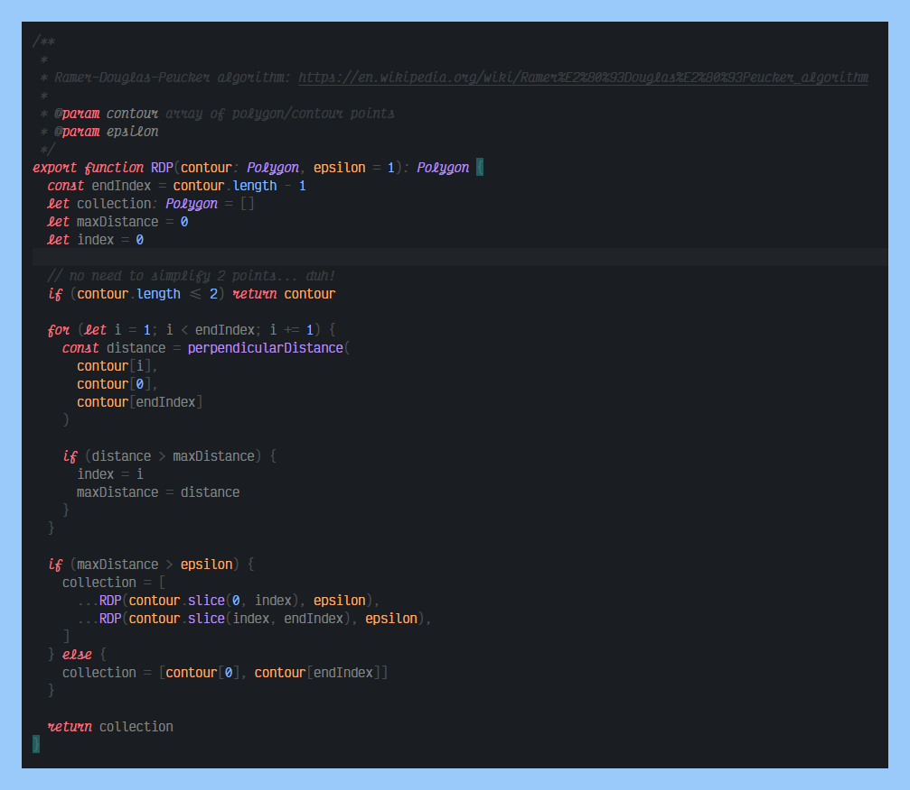

# Github Dark Easy

## Modified Github Dark theme for VS Code, easy on the eyes

https://marketplace.visualstudio.com/items?itemName=mubaidr.github-dark-easy

## Previews

### Typescript

  

### HTML

  

### JSON

  

## Notes

- All credits to the original [Github Theme](https://marketplace.visualstudio.com/items?itemName=GitHub.github-vscode-theme) develepors
- [Victor Mono](https://rubjo.github.io/victor-mono/) font is used in preview images

**Enjoy!**
